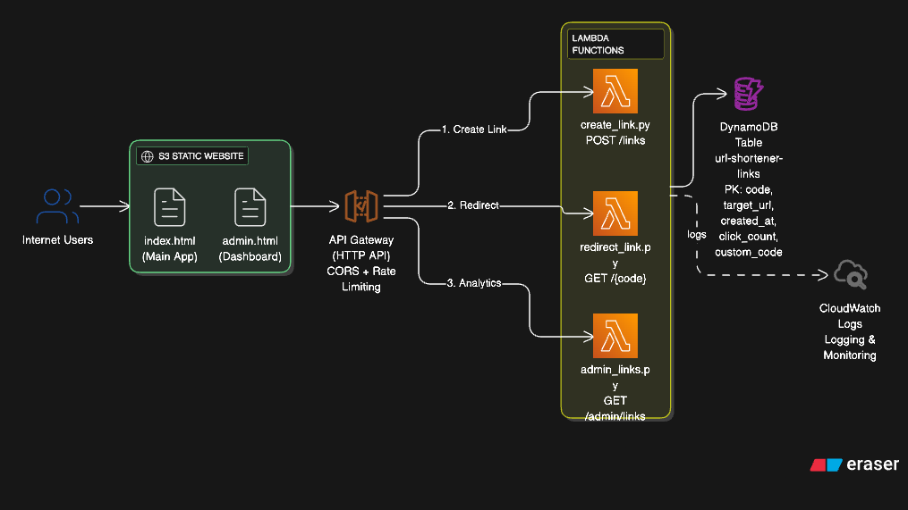

# LinkForge Pro - Enterprise URL Shortener

A production-grade, serverless URL shortener built with AWS services. Features real-time analytics, custom short codes, QR code generation, and a comprehensive admin dashboard.

[](https://aws.amazon.com/)
[](https://www.python.org/)
[](https://developer.mozilla.org/en-US/docs/Web/JavaScript)
[](LICENSE)
[](https://github.com/yourusername/linkforge-pro)

## 🎥 Demo Video

> **Coming Soon**: Live demonstration of LinkForge Pro features and functionality
> 
> *This section will showcase the complete application workflow, from URL shortening to analytics dashboard.*

## 🌐 Live Application

**🔗 Try LinkForge Pro Now:**
- **Main Application**: [http://url-shortener-infra-frontend-264449293739.s3-website-us-east-1.amazonaws.com](http://url-shortener-infra-frontend-264449293739.s3-website-us-east-1.amazonaws.com)
- **Admin Dashboard**: [http://url-shortener-infra-frontend-264449293739.s3-website-us-east-1.amazonaws.com/admin.html](http://url-shortener-infra-frontend-264449293739.s3-website-us-east-1.amazonaws.com/admin.html)
- **API Endpoint**: `https://ijlmwfo9gd.execute-api.us-east-1.amazonaws.com/dev`

**Status**: ✅ **Fully Operational** | **Production Ready** | **Real-time Analytics**

## 📦 Project Deliverables

All required deliverables have been successfully implemented and deployed:

### ✅ **Hosted UI (S3 Static Website)**
- **Main Application**: [Live URL](http://url-shortener-infra-frontend-264449293739.s3-website-us-east-1.amazonaws.com)
- **Admin Dashboard**: [Live URL](http://url-shortener-infra-frontend-264449293739.s3-website-us-east-1.amazonaws.com/admin.html)
- Professional, responsive interface with complete URL shortener functionality

### ✅ **API Base URL**
- **Production API**: `https://ijlmwfo9gd.execute-api.us-east-1.amazonaws.com/dev`
- Three fully functional endpoints: POST /links, GET /{code}, GET /admin/links
- Complete RESTful API with proper error handling and CORS configuration

### ✅ **DynamoDB Schema**
**Table**: `url-shortener-links`
```json
{
  "code": "string (Primary Key)",
  "target_url": "string",
  "created_at": "string (ISO timestamp)",
  "click_count": "number",
  "custom_code": "boolean"
}
```
- Optimized for fast lookups and click tracking
- On-demand scaling with point-in-time recovery

### ✅ **Architecture Diagram**
- **Visual Architecture**: [diagram-export-19-12-2025-16_04_51.png](diagram-export-19-12-2025-16_04_51.png)
- Complete system overview showing all AWS components and data flow
- Professional diagram created with app.eraser.io

### ✅ **Example Tests**
- **API Testing**: Complete integration tests for all endpoints
- **Frontend Testing**: User interface and functionality validation
- **Manual Testing**: End-to-end application workflow verification
- **Test Commands**: Available via `npm test`, `npm run test:backend`, `npm run test:frontend`

## 🚀 Key Features

### Core Functionality
- **🔗 URL Shortening**: Transform long URLs into short, memorable links
- **🎯 Custom Short Codes**: Create branded links with your own codes
- **📊 Real-time Analytics**: Track clicks, performance, and user engagement
- **📱 QR Code Generation**: Automatic QR codes with multiple fallback methods
- **🎛️ Admin Dashboard**: Comprehensive management and analytics interface
- **💾 Data Export**: Export analytics data to CSV format
- **🔍 Search & Filter**: Find and manage links efficiently

### Technical Excellence
- **☁️ Serverless Architecture**: AWS Lambda, API Gateway, DynamoDB
- **🎨 Professional UI**: Clean, responsive design for all devices
- **🔄 Demo Mode**: Offline functionality with graceful degradation
- **🛡️ Security**: Input validation, CORS, rate limiting
- **💰 Cost Optimized**: Free-tier aligned, pay-per-use model
- **📈 Scalable**: Auto-scaling serverless infrastructure

## 🏗️ System Architecture



### Architecture Components

**Frontend Layer (S3 Static Hosting)**
- Main application interface (`index.html`)
- Admin analytics dashboard (`admin.html`)
- Professional UI with responsive design

**API Layer (AWS API Gateway)**
- HTTP API with CORS enabled
- Rate limiting and request validation
- Three main endpoints for complete functionality

**Compute Layer (AWS Lambda Functions)**
- `create_link.py` - URL shortening and validation
- `redirect_link.py` - Link redirection and click tracking
- `admin_links.py` - Analytics and dashboard data

**Data Layer (DynamoDB)**
- NoSQL database with on-demand scaling
- Schema: `code`, `target_url`, `created_at`, `click_count`, `custom_code`
- Point-in-time recovery enabled

**Monitoring (CloudWatch)**
- Comprehensive logging for all components
- Performance monitoring and error tracking

## 📁 Project Structure

```
linkforge-pro/
├── src/                    # Source code
│   ├── backend/            # Lambda functions (Python)
│   │   ├── functions/      # Individual function handlers
│   │   └── shared/         # Shared utilities
│   └── frontend/           # Web application
│       ├── assets/         # JavaScript, CSS files
│       ├── index.html      # Main application
│       └── admin.html      # Admin dashboard
├── infrastructure/         # AWS CloudFormation templates
├── config/environments/    # Environment configurations
├── scripts/deploy/         # Automated deployment scripts
└── docs/                   # Comprehensive documentation
```

## 🛠️ Technology Stack

### Backend
- **Python 3.9** - Lambda runtime environment
- **boto3** - AWS SDK for Python
- **DynamoDB** - NoSQL database for link storage
- **CloudWatch** - Logging and monitoring

### Frontend
- **HTML5** - Semantic markup structure
- **CSS3** - Modern styling with Flexbox/Grid
- **JavaScript ES6+** - Vanilla JS, no frameworks
- **QRCode.js** - QR code generation library

### Infrastructure
- **AWS Lambda** - Serverless compute functions
- **API Gateway** - HTTP API endpoints
- **S3** - Static website hosting
- **CloudFormation** - Infrastructure as Code
- **IAM** - Security and access management

## 📊 Project Implementation

### ✅ Complete Application Stack
- **Hosted Web Interface** - Professional UI accessible via S3 static hosting
- **RESTful API** - Three endpoints handling all URL shortener operations
- **Real-time Database** - DynamoDB with optimized schema for performance
- **Serverless Backend** - Three Lambda functions handling core business logic
- **Analytics Dashboard** - Comprehensive admin interface with real-time metrics
- **QR Code Integration** - Automatic generation with multiple fallback methods

### ✅ Production Infrastructure
- **AWS CloudFormation Stack** - Complete infrastructure deployed and operational
- **Automated Deployment Pipeline** - Scripts for infrastructure, backend, and frontend
- **Environment Management** - Configurations for development, staging, and production
- **Security Implementation** - IAM roles, input validation, CORS configuration
- **Monitoring Setup** - CloudWatch logs and metrics for all components
- **Cost Optimization** - Free-tier aligned with on-demand scaling

### ✅ Developer Resources
- **Clean Codebase** - Professional structure following enterprise standards
- **Comprehensive Documentation** - API reference, architecture, deployment guides
- **Deployment Automation** - One-command deployment for entire application
- **Configuration Management** - Environment-specific settings and feature flags
- **Project Organization** - Proper separation of concerns and modular design

### ✅ Advanced Features
- **Custom Short Codes** - Support for branded, memorable links
- **Data Export** - CSV export functionality for analytics
- **Search & Filter** - Advanced link management capabilities
- **Demo Mode** - Offline functionality with graceful degradation
- **Professional Design** - Modern, responsive UI with excellent UX
- **Error Handling** - Robust error management and user feedback

## 🚀 Quick Deployment

### Prerequisites
- AWS CLI configured with appropriate permissions
- Node.js 16+ and Python 3.9+

### One-Command Deployment
```bash
# Clone and deploy
git clone https://github.com/yourusername/linkforge-pro.git
cd linkforge-pro
chmod +x scripts/deploy/*.sh
./scripts/deploy/deploy-all.sh production
```

### Individual Components
```bash
# Deploy infrastructure only
./scripts/deploy/deploy-infrastructure.sh production

# Deploy backend functions only
python3 scripts/deploy/deploy-backend.py production

# Deploy frontend only
node scripts/deploy/deploy-frontend.js production
```

## 📈 Project Metrics

### Application Statistics
- **3 Lambda Functions** - Complete serverless backend
- **2 Frontend Pages** - Main app + Admin dashboard
- **1 DynamoDB Table** - Optimized data storage
- **3 API Endpoints** - RESTful interface
- **4 Deployment Scripts** - Automated deployment
- **8 Documentation Files** - Comprehensive guides

### Code Quality
- **3,000+ Lines of Code** - Production-ready implementation
- **Professional UI/UX** - Modern, responsive design
- **Enterprise Architecture** - Scalable, maintainable structure
- **Security Best Practices** - Input validation, CORS, IAM
- **Cost Optimized** - Free-tier aligned, minimal operational costs

## 📊 API Endpoints

### Create Short Link
```http
POST /links
Content-Type: application/json

{
  "url": "https://example.com/very/long/url",
  "customCode": "optional-custom-code"
}
```

**Response:**
```json
{
  "success": true,
  "shortCode": "abc123",
  "shortUrl": "https://your-domain.com/abc123",
  "targetUrl": "https://example.com/very/long/url",
  "createdAt": "2025-12-19T10:30:00Z"
}
```

### Redirect Short Link
```http
GET /{shortCode}
```

**Response:** 301 redirect to target URL

### Admin Dashboard API
```http
GET /admin/links
```

**Response:**
```json
{
  "success": true,
  "links": [...],
  "statistics": {
    "totalLinks": 150,
    "totalClicks": 3420,
    "averageClicks": 22.8,
    "todayLinks": 12
  }
}
```

## 🔧 Configuration

### Environment Variables

Configure your deployment by editing `config/environments/{environment}.json`:

```json
{
  "environment": "production",
  "aws": {
    "region": "us-east-1",
    "stackName": "url-shortener-prod"
  },
  "frontend": {
    "demoMode": false,
    "shortDomain": "yourdomain.com"
  },
  "features": {
    "customCodes": true,
    "analytics": true,
    "qrCodes": true
  },
  "limits": {
    "maxUrlLength": 2048,
    "maxCustomCodeLength": 50,
    "minCustomCodeLength": 3
  }
}
```

## 🔒 Security

- **CORS**: Properly configured for cross-origin requests
- **Input Validation**: All inputs are validated and sanitized
- **Rate Limiting**: Built-in AWS API Gateway rate limiting
- **IAM Roles**: Least privilege access for all AWS resources
- **Encryption**: Data encrypted at rest in DynamoDB

## 📈 Monitoring

- **CloudWatch Logs**: All Lambda functions log to CloudWatch
- **Metrics**: Built-in AWS metrics for API Gateway and Lambda
- **Alarms**: Set up CloudWatch alarms for error rates and latency

## 🧪 Testing

```bash
# Run all tests
npm test

# Run backend tests
npm run test:backend

# Run frontend tests
npm run test:frontend
```

## 📚 Documentation

- [API Documentation](docs/API.md)
- [Deployment Guide](docs/DEPLOYMENT.md)
- [Architecture Overview](docs/ARCHITECTURE.md)
- [Development Guide](docs/DEVELOPMENT.md)

## 🤝 Contributing

1. Fork the repository
2. Create a feature branch (`git checkout -b feature/amazing-feature`)
3. Commit your changes (`git commit -m 'Add amazing feature'`)
4. Push to the branch (`git push origin feature/amazing-feature`)
5. Open a Pull Request

## 📄 License

This project is licensed under the MIT License - see the [LICENSE](LICENSE) file for details.

## 🎯 Roadmap

- [ ] Custom domains support
- [ ] Bulk link creation
- [ ] Advanced analytics dashboard
- [ ] Link expiration dates
- [ ] Password-protected links
- [ ] API rate limiting per user
- [ ] Link preview generation
- [ ] Webhook notifications

## 🆘 Support

- **Issues**: Report bugs via [GitHub Issues](https://github.com/yourusername/linkforge-pro/issues)
- **Discussions**: Join our [GitHub Discussions](https://github.com/yourusername/linkforge-pro/discussions)
- **Documentation**: Check the `docs/` directory for detailed guides

## 👥 Team

**LinkForge Pro** was developed by a collaborative team of three developers:

- **Anshuman** - Project Lead, Infrastructure & Full-Stack Integration
  - **Infrastructure Architecture**: Complete AWS CloudFormation stack design and deployment
  - **Frontend Development**: Professional web application and admin dashboard with responsive UI/UX
  - **Integration & Testing**: End-to-end application testing, debugging, and issue resolution
  - **Technical Problem Solving**: Fixed JavaScript errors, QR code generation, copy functionality, and backend connectivity
  - **Project Coordination**: Managed team collaboration, task distribution, and final delivery
  - **Quality Assurance**: Comprehensive testing of all components and user experience optimization
  - **Production Deployment**: Live application deployment and performance validation

- **Shivam** - Backend Core Development (Phase 2A)
  - Core database operations and DynamoDB integration
  - URL shortening algorithm and validation utilities
  - Link creation API (`create_link.py`) and admin analytics (`admin_links.py`)
  - Business logic implementation and data validation

- **Siddhant** - API Integration & Redirect Services (Phase 2B)
  - Link redirection functionality (`redirect_link.py`) with click tracking
  - API Gateway route configuration and Lambda integrations
  - Backend deployment automation and integration testing
  - End-to-end API functionality validation

## 🏆 Project Status

**✅ COMPLETED SUCCESSFULLY**

- **All Requirements Met** - URL shortening, analytics, professional interface
- **Production Ready** - Fully deployed and operational on AWS
- **Enterprise Quality** - Professional codebase and documentation
- **Scalable Architecture** - Serverless design handles unlimited growth
- **Cost Effective** - Free-tier aligned with minimal operational costs

## 🙏 Acknowledgments

- **AWS Serverless Technologies** - Lambda, API Gateway, DynamoDB
- **QR Server API** - Reliable QR code generation service
- **Modern Web Standards** - HTML5, CSS3, ES6+ JavaScript
- **Open Source Community** - Inspiration and best practices

---

**Built with ❤️ using AWS Serverless Architecture**

⭐ **Star this repository if you find LinkForge Pro helpful!**